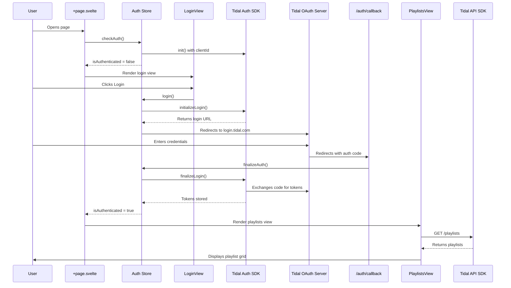

# Architecture

## Overview

Tidal Playlist Organizer is a SvelteKit application built with TypeScript that uses the Tidal Web SDK to authenticate users and display their playlists. The application follows OAuth 2.0 Authorization Code Flow with PKCE for secure authentication.

## Authentication and API Flow



## Key Components

### 1. Frontend Architecture (SvelteKit)

- **SvelteKit application** with TypeScript
- **Component-based architecture** for reusability and maintainability
- **Svelte stores** for reactive state management
- **File-based routing** via SvelteKit
- **Type-safe** development with TypeScript throughout

### 2. State Management Layer

#### Auth Store (`src/lib/stores/auth.ts`)
- Manages authentication state (isAuthenticated, userId, isLoading, error)
- Provides actions: `checkAuth()`, `login()`, `finalizeAuth()`, `logout()`
- Syncs with localStorage for session persistence
- Wraps Tidal Auth SDK for reactive state updates

#### Config Store (`src/lib/stores/config.ts`)
- Provides read-only access to environment variables
- Centralizes configuration management
- Type-safe configuration access

### 3. Authentication Layer (@tidal-music/auth)

- **OAuth 2.0 with PKCE** - No client secret needed in browser
- **Automatic token refresh** - SDK handles token expiration
- **Encrypted storage** - Tokens stored securely in localStorage
- **Session persistence** - Users stay logged in across page reloads

### 4. API Layer (@tidal-music/api)

- **Type-safe API client** - Generated from OpenAPI spec
- **Automatic authentication** - Uses credentialsProvider for token injection
- **JSON:API format** - Follows Tidal's API specification
- **Error handling** - Structured error responses

## Component Hierarchy

```
+layout.svelte (global styles)
└── +page.svelte (main orchestrator)
    ├── Header (title and subtitle)
    └── Conditional:
        ├── LoginView (when not authenticated)
        │   ├── ErrorMessage
        │   └── Login button
        └── PlaylistsView (when authenticated)
            ├── User header with logout button
            ├── LoadingSpinner (while fetching)
            ├── ErrorMessage (on error)
            ├── Empty state (no playlists)
            └── Playlist grid
                └── PlaylistCard (for each playlist)
```

### Component Responsibilities

#### Core Routes
- **`+layout.svelte`**: Root layout with global styles (gradient background, CSS reset)
- **`+page.svelte`**: Main page that checks auth and renders appropriate view
- **`auth/callback/+page.svelte`**: OAuth callback handler, processes auth code

#### Presentational Components
- **`Header.svelte`**: Displays title and subtitle with gradient styling
- **`ErrorMessage.svelte`**: Conditionally displays error messages
- **`LoadingSpinner.svelte`**: Shows loading animation with message

#### Feature Components
- **`LoginView.svelte`**: Login card with OAuth initiation
- **`PlaylistsView.svelte`**: Fetches and displays playlists, handles logout
- **`PlaylistCard.svelte`**: Individual playlist display with cover art

## Data Flow

### Initial Load

1. User visits app → `+page.svelte` loads
2. `onMount()` calls `authStore.checkAuth()`
3. Auth store initializes Tidal SDK
4. Attempts to get existing credentials
5. If valid token exists → show PlaylistsView
6. If no token → show LoginView

### Login Flow

1. User clicks "Login with Tidal" in LoginView
2. LoginView calls `authStore.login()`
3. Auth store:
   - Stores config in localStorage
   - Initializes Tidal Auth SDK
   - Gets login URL from SDK
   - Redirects to Tidal OAuth page
4. User authenticates on Tidal
5. Tidal redirects to `/auth/callback` with auth code
6. Callback route:
   - Calls `authStore.finalizeAuth()`
   - Auth store exchanges code for tokens via SDK
   - Extracts user ID from JWT
   - Updates auth state
   - Redirects to home with `goto('/')`
7. Main page re-renders with PlaylistsView

### Playlist Retrieval

1. PlaylistsView mounts
2. `onMount()` calls `loadPlaylists()`
3. Get userId from auth store
4. Create API client with credentialsProvider
5. Call `GET /playlists` with filters:
   - `filter[owners.id]`: User's ID
   - `include`: Cover art and owners
   - `countryCode`: User's region
   - `sort`: By last modified date
6. Parse response and extract cover art URLs
7. Render playlist grid with PlaylistCard components

## Security Considerations

### What's Secure

- ✅ OAuth with PKCE (no client secret in browser)
- ✅ Tokens encrypted in localStorage via SDK
- ✅ Automatic token refresh
- ✅ HTTPS-only for OAuth (localhost exception)
- ✅ Environment variables for sensitive config
- ✅ Type safety prevents common errors

### Known Limitations

- ⚠️ localStorage can be accessed by browser extensions
- ⚠️ No server-side validation
- ⚠️ Client ID visible in browser (acceptable for public apps)

## Technology Stack

| Component          | Technology              | Version  | Purpose                    |
| ------------------ | ----------------------- | -------- | -------------------------- |
| Framework          | SvelteKit               | ^2.49.1  | Web framework & routing    |
| UI Library         | Svelte                  | ^5.45.6  | Reactive components        |
| Language           | TypeScript              | ^5.9.3   | Type safety                |
| Auth SDK           | @tidal-music/auth       | ^1.4.0   | Authentication             |
| API Client         | @tidal-music/api        | ^0.7.0   | API requests               |
| Build Tool         | Vite                    | ^7.2.6   | Dev server & bundling      |
| Package Manager    | npm                     | -        | Dependencies               |
| Adapter            | @sveltejs/adapter-auto  | ^7.0.0   | SvelteKit deployment       |

## Configuration

### Environment Variables (via Vite)

- `VITE_TIDAL_CLIENT_ID` - From Tidal Developer Portal
- `VITE_TIDAL_REDIRECT_URI` - Must match registered URI (e.g., `http://localhost:5173/auth/callback`)
- `VITE_COUNTRY_CODE` - ISO 3166-1 alpha-2 (optional, defaults to NO)

### Runtime Configuration

- `credentialsStorageKey: 'tidalPlaylistOrganizer'` - localStorage key for tokens
- Scopes: `['playlists.read', 'user.read']`

## API Endpoints Used

### GET /playlists

**Purpose**: Retrieve user's playlists

**Parameters**:

- `filter[owners.id]` - User ID (extracted from JWT)
- `include` - Related resources (coverArt, owners)
- `countryCode` - Region for content licensing (optional)
- `sort` - Sort order (default: -lastModifiedAt)

**Response**: JSON:API document with playlist data and included resources

## Routing

### Main Routes

- `/` - Home page (login or playlists view)
- `/auth/callback` - OAuth callback handler

### Redirect Flow

1. User initiates login → Redirect to Tidal OAuth
2. Tidal authenticates → Redirect to `/auth/callback`
3. Callback completes auth → Redirect to `/` (home)

## Future Enhancements

Potential features to add:

- Pagination for users with many playlists
- Search/filter functionality
- Playlist editing (rename, delete)
- Track management (add/remove tracks)
- Drag-and-drop organization
- Export playlist data
- Dark mode toggle
- Playlist playback integration
- Server-side rendering for better SEO

## Development

### Local Setup

```bash
npm install          # Install dependencies
cp env.template .env # Configure environment
npm run dev          # Start dev server (port 5173)
```

### File Structure

```
tidal-playlist-organizer/
├── src/
│   ├── lib/
│   │   ├── assets/          # Static assets (favicon, etc.)
│   │   ├── components/      # Reusable Svelte components
│   │   ├── stores/          # Svelte stores (auth, config)
│   │   ├── types/           # TypeScript type definitions
│   │   └── utils/           # Utility functions
│   ├── routes/
│   │   ├── auth/callback/   # OAuth callback route
│   │   ├── +layout.svelte   # Root layout
│   │   └── +page.svelte     # Main page
│   ├── app.d.ts             # App type definitions
│   └── app.html             # HTML shell
├── static/                  # Static files
├── package.json             # Dependencies
├── svelte.config.js         # SvelteKit configuration
├── vite.config.ts           # Vite configuration
├── tsconfig.json            # TypeScript configuration
├── env.template             # Environment template
├── .env                     # User configuration (git-ignored)
└── README.md                # Documentation
```

## References

- [Tidal Developer Portal](https://developer.tidal.com)
- [Tidal SDK Documentation](https://tidal-music.github.io/tidal-sdk-web/)
- [Tidal API Reference](https://tidal-music.github.io/tidal-api-reference/)
- [SvelteKit Documentation](https://kit.svelte.dev/)
- [OAuth 2.0 PKCE Specification](https://oauth.net/2/pkce/)
