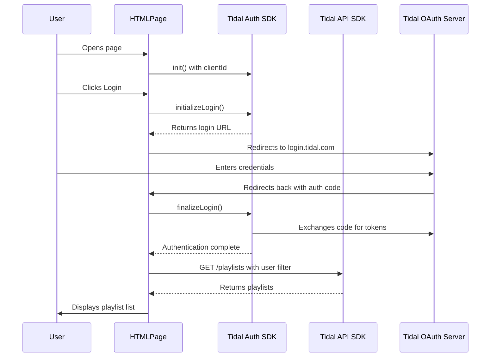

# Architecture

## Overview

Tidal Playlist Organizer is a single-page application that uses the Tidal Web SDK to authenticate users and display their playlists. The application follows OAuth 2.0 Authorization Code Flow with PKCE for secure authentication.

## Authentication and API Flow



## Key Components

### 1. Frontend (index.html)

- **Single-page application** using vanilla JavaScript (ES modules)
- **Responsive UI** with CSS Grid and Flexbox
- **State management** via localStorage for configuration and SDK for tokens
- **No build step required** - runs directly in browser via Vite dev server

### 2. Authentication Layer (@tidal-music/auth)

- **OAuth 2.0 with PKCE** - No client secret needed in browser
- **Automatic token refresh** - SDK handles token expiration
- **Encrypted storage** - Tokens stored securely in localStorage
- **Session persistence** - Users stay logged in across page reloads

### 3. API Layer (@tidal-music/api)

- **Type-safe API client** - Generated from OpenAPI spec
- **Automatic authentication** - Uses credentialsProvider for token injection
- **JSON:API format** - Follows Tidal's API specification
- **Error handling** - Structured error responses

## Data Flow

### Initial Load

1. Check for stored configuration (clientId, redirectUri)
2. Initialize auth SDK
3. Attempt to get existing credentials
4. If valid token exists → show playlists view
5. If no token → show login view

### Login Flow

1. User clicks "Login with Tidal"
2. Store config in localStorage
3. Redirect to Tidal OAuth page
4. User authenticates
5. Redirect back with authorization code
6. SDK exchanges code for tokens
7. Store encrypted tokens
8. Fetch and display playlists

### Playlist Retrieval

1. Get credentials from SDK (includes fresh token)
2. Decode JWT to extract user ID
3. Call `GET /playlists` with filters:
   - `filter[owners.id]`: User's ID
   - `include`: Cover art and owners
   - `countryCode`: User's region (optional)
   - `sort`: By last modified date
4. Parse response and extract cover art URLs
5. Render playlist grid

## Security Considerations

### What's Secure

- ✅ OAuth with PKCE (no client secret in browser)
- ✅ Tokens encrypted in localStorage
- ✅ Automatic token refresh
- ✅ HTTPS-only for OAuth (localhost exception)
- ✅ Environment variables for sensitive config

### Known Limitations

- ⚠️ localStorage can be accessed by browser extensions
- ⚠️ No server-side validation
- ⚠️ Client ID visible in browser (acceptable for public apps)

## Technology Stack

| Component       | Technology        | Version | Purpose               |
| --------------- | ----------------- | ------- | --------------------- |
| Frontend        | HTML/CSS/JS       | ES2020+ | UI and logic          |
| Auth            | @tidal-music/auth | ^1.4.0  | Authentication        |
| API Client      | @tidal-music/api  | ^0.7.0  | API requests          |
| Build Tool      | Vite              | ^7.3.0  | Dev server & bundling |
| Package Manager | npm/pnpm          | -       | Dependencies          |

## Configuration

### Environment Variables (via Vite)

- `VITE_TIDAL_CLIENT_ID` - From Tidal Developer Portal
- `VITE_TIDAL_REDIRECT_URI` - Must match registered URI
- `VITE_COUNTRY_CODE` - ISO 3166-1 alpha-2 (optional, defaults to NO)

### Runtime Configuration

- `credentialsStorageKey: 'tidalPlaylistOrganizer'` - localStorage key for tokens
- Scopes: `['playlists.read', 'user.read', 'r_usr']`

## API Endpoints Used

### GET /playlists

**Purpose**: Retrieve user's playlists

**Parameters**:

- `filter[owners.id]` - User ID (extracted from JWT)
- `include` - Related resources (coverArt, owners)
- `countryCode` - Region for content licensing (optional)
- `sort` - Sort order (default: -lastModifiedAt)

**Response**: JSON:API document with playlist data and included resources

## Future Enhancements

Potential features to add:

- Pagination for users with many playlists
- Search/filter functionality
- Playlist editing (rename, delete)
- Track management (add/remove tracks)
- Drag-and-drop organization
- Export playlist data
- Dark mode
- Playlist playback integration

## Development

### Local Setup

```bash
npm install          # Install dependencies
cp env.template .env # Configure environment
npm run dev         # Start dev server (port 5173)
```

### File Structure

```
tidal-playlist-organizer/
├── index.html          # Main application
├── package.json        # Dependencies
├── vite.config.js      # Build configuration
├── env.template        # Environment template
├── .env               # User configuration (git-ignored)
├── .gitignore         # Git ignore rules
├── README.md          # User documentation
├── QUICKSTART.md      # Quick setup guide
├── ARCHITECTURE.md    # This file
└── IMPLEMENTATION_SUMMARY.md  # Implementation notes
```

## References

- [Tidal Developer Portal](https://developer.tidal.com)
- [Tidal SDK Documentation](https://tidal-music.github.io/tidal-sdk-web/)
- [Tidal API Reference](https://tidal-music.github.io/tidal-api-reference/)
- [OAuth 2.0 PKCE Specification](https://oauth.net/2/pkce/)
